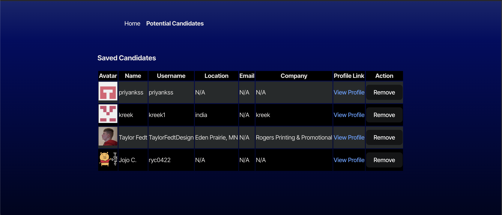

# PickACrew

## Description

PickACrew is a React component that fetches and displays GitHub users, allowing you to view, save, or skip profiles. It uses the GitHub API to search for users and allows you to save your preferred candidates locally in localStorage.

## Features
- Fetch GitHub Users: Retrieve a list of GitHub users from the GitHub API.
- Profile Display: Show each user’s profile with details like name, location, company, and email.
- Save/Skip Options: Save selected candidates to localStorage or skip to view the next profile.
- Simple, Clean UI: Minimal styling for easy integration.

## Technologies Used

- React
- TypeScript
- local storage
- CSS
- GitHub API

## Usage

- View Profiles: The app fetches a GitHub user's profile and displays it in a card format.
- Save/Skip Candidates:
- Click Save to store the candidate’s information in localStorage for future reference.
- Click Skip to load the next available candidate.
- Local Storage: Saved candidates are stored in localStorage under the key savedCandidates.

## Contact:

Oscar Rendon

Code sourced with help ChatGPT, Xpert learning Assistant.

- github Link: https://github.com/Danr55/PickACrew
- Website Link: https://pickacrew.netlify.app/

